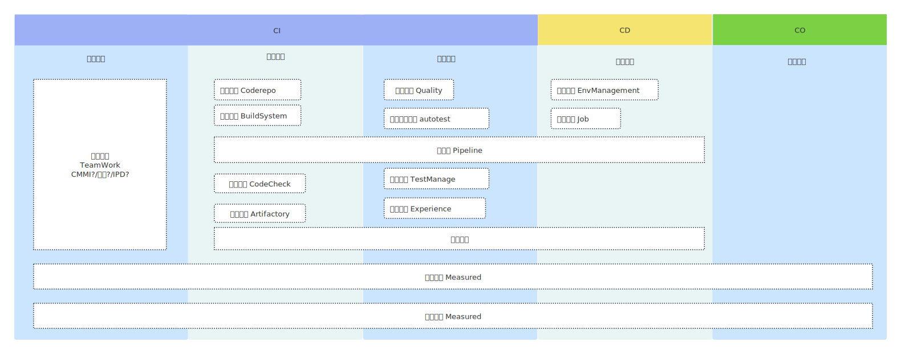
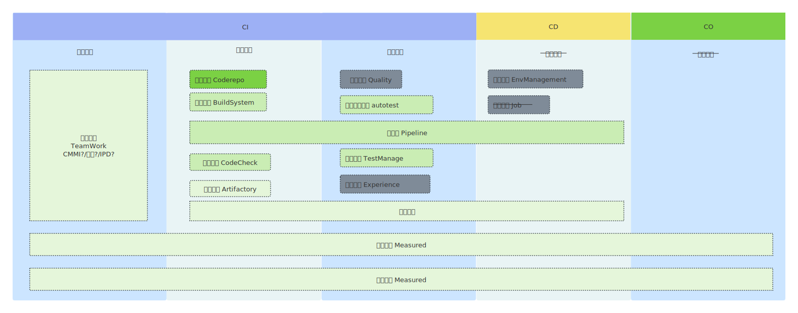

扉页
===================================

:更新时间:  2026/04/17

:原作者:

    .. line-block::
        薛冰冰

:项目主页:

    - `DevOps plan <https://github.com/xueye9/devops-docs>`_

背景
-----------------

介绍
----------------
DevOps 源于 Development 和 Operations 的组合， 是一种重视"软件开发人员(Dev)"和"IT运维技术人员(Ops)"之间沟通合作的文化
运动或惯例。透过自动化"软件交付"和"架构变更"的流程, 来使得构建、测试、发布软件能够更加快捷、频繁和可靠。

现状
-----------------
公司DevOps各种设施的现状, 绿色的深浅代表成熟度, 绿色颜色越深表示成熟度越高,灰色代表尚未建设的,删除线表示没有技术规划的.

本文目标
-----------------

本文旨在介绍公司 DevOps 的规划,用于指导公司研发过程的基础设施建设的节奏.

○
◔
◑
◕
●